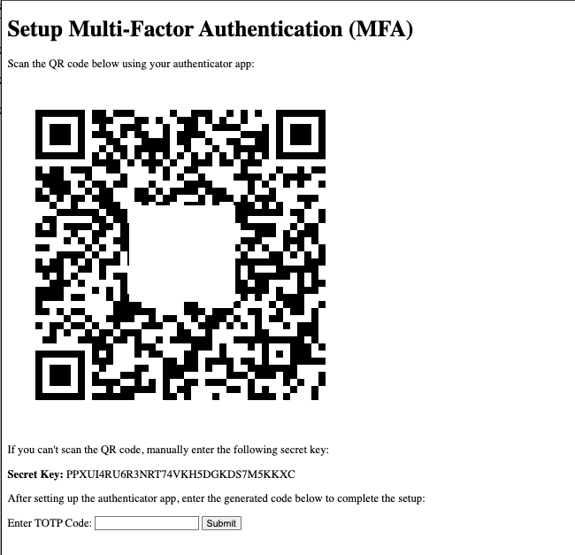

# Demo Flask MFA App

This application demonstrates a basic Flask app implementing Multi-Factor Authentication (MFA) with TOTP (Time-based One-time Password).

## Features

- User login and authentication
- MFA setup with QR code generation for TOTP
- MFA verification
- User logout

## Getting Started

### Prerequisites

Ensure you have Python 3.6+ installed on your system.

### Installation

1. Install the required dependencies:
```
pip3 install -r requirements.txt
```

2. The default user account for demonstration purposes has a predefined password. You can change it in the `demo_app_mfa_totp.py`:

```python
users = {'demo': {'password': 'changeme', 'mfa_secret_key': None, 'backup_codes': []}}
```

3. Run the application:
```
python3 demo_app_mfa_totp.py
```

The application should now be running on `http://127.0.0.1:5000/`.

## Usage

Navigate to `http://127.0.0.1:5000/` in your web browser to start using the application.

Below is an example of the set up page:


