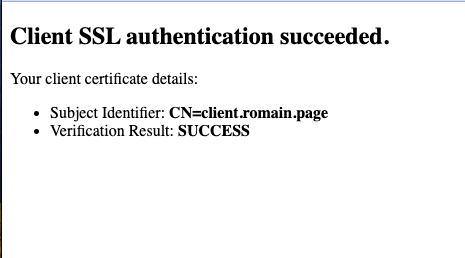

# Nginx with Client Certificate Authentication Demo

This demo sets up an Nginx server configured for SSL/TLS with Client Certificate Authentication (CAC), serving a simple HTML page. It demonstrates how to configure Nginx to require and validate client certificates, ensuring secure, encrypted connections while identifying clients based on SSL certificates.

## Prerequisites

- Docker installed on your machine.
- SSL/TLS Certificates: You will need:
  - A combination of Root CA and intermediate certificates (`combined.pem`).
  - A client certificate signed by the intermediate CA.

For generating a client CA in PKCS#12 format (.p12), use the following command:

```sh
openssl pkcs12 -export -out client_certificate.p12 -inkey client_privkey.key -in client_cert.crt -certfile CAcert.crt -legacy
```

Parameters:

- `client_certificate.p12`: The output file name for the PKCS#12 format certificate.
- `client_privkey.key`: The private key file.
- `client_cert.crt`: The client's certificate file.
- `CAcert.crt`: The Certificate Authority's certificate that signed your client certificate.

Before moving on to the setup steps, it's important to ensure that your client certificate is properly prepared and available. The following image illustrates an example of a client certificate that has been successfully imported into a keychain:


## Setup

1. Generating demo SSL/TLS Certificates

Before building the Docker image, generate a demo server certificate and private key:

```sh
openssl genrsa -out server_privkey.pem 2048
openssl req -new -key server_privkey.pem -out server.csr -subj "/C=FR/L=Chambery/OU=Product/CN=Product Demo"
openssl x509 -req -days 90 -in server.csr -signkey server_privkey.pem -out server_cert.pem
rm server.csr
```

These commands create `server_cert.pem` and `server_privkey.pem` which are used by the Nginx server for SSL/TLS.

2. **Build and Run the Docker image**:

```sh
docker-compose up --build -d
```

This command builds the Docker images for both the Nginx reverse proxy and the Flask application as defined in your `docker-compose.yml` file, and then starts the containers in detached mode. The services are configured to communicate with each other as specified in your Docker Compose configuration.

- The Nginx container is configured to listen on port 443 inside the container. By mapping this to port 8443 (or any other port you've configured) on your host, you can access the demo website via HTTPS at `https://localhost:8443`. Ensure your `docker-compose.yml` file has the correct port mappings for this to work.

- The Flask application container runs the demo app, which is accessible to Nginx via the internal network defined by your `docker-compose.yml` file. The Flask application itself does not need to be directly accessible from the host; instead, it's accessed through the Nginx reverse proxy, which handles SSL/TLS termination and forwards requests to the Flask app.

## Accessing the Demo Website

After the container is running, you can access the demo website by navigating to `https://localhost:8443` in your web browser. You must have a client certificate installed in your browser or available to present during the connection setup, as the Nginx server is configured to require and verify client certificates for connections.

Ensure that the client certificate is signed by the intermediate CA, which is specified in your Nginx configuration and employed to validate your client certificate.

Before accessing the website, you will be prompted to select a client certificate:


Once the correct client certificate is selected and authentication succeeds, you will gain access to the secured content:



## Troubleshooting

If you encounter any issues accessing the website or if the client certificate authentication fails, check the following:

- Ensure your client certificate is properly installed in your browser.
- Verify that the `default.conf` file is correctly configured for SSL and client certificate requirements.
- Check the Docker container logs for any errors: `docker logs nginx-cac-flaskapp-1` or `docker logs nginx-cac-nginx-1`
